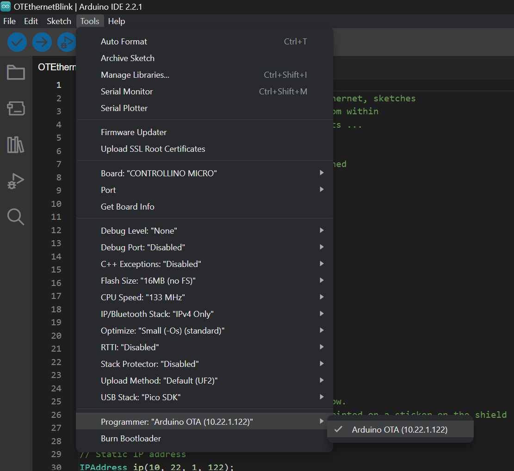
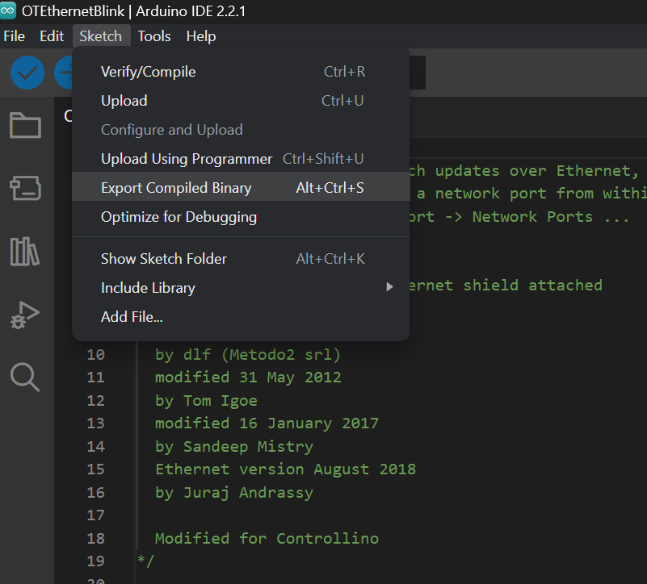

# ArduinoOTA support example for Controllino RP2040 Boards

This example shows how to use ArduinoOTA library build in within Controllino RP2040 Arduino Core, to update the firmware of the Controllino board over Ethernet.

Of course review the documentation of ArduinoOTA library for more details: <https://github.com/JAndrassy/ArduinoOTA/tree/master>. In some cases the ArduinoOTA port is not detected by Arduino IDE, thats why we explain the programer method which is valid in every case.

## Usage from Arduino IDE

1. With the Controllino RP2040 Arduino Core installed, open the example in Arduino IDE and upload it to the board, using the normal method over serial port or using the uf2 putting the board in boot mode.

2. With the Ethernet connection, properly established (notice that the computer most be in the same range as the Controllino **10.22.1.X** see [OTEthernetBlink.ino](OTEthernetBlink.ino)), select the ArduinoOTA programer and use Upload Using Programmer option in Arduino IDE.




3. You can change the ip, user and password for the programer by editing programers.txt file on the Controllino RP2040 Arduino Core installation folder, then restart Arduino IDE to apply, for example on Windows:

```bash
C:\Users\[user]\AppData\Local\Arduino15\packages\controllino_rp2040\hardware\rp2040\[version]\programmers.txt
```

```bash
arduinoOTA122.name=Arduino OTA (10.22.1.122)
arduinoOTA122.program.tool=arduinoOTA
arduinoOTA122.program.tool.default=arduinoOTA
arduinoOTA122.ip=10.22.1.122
arduinoOTA122.user=arduino
arduinoOTA122.password=password
```

## Usage from command line

1. Download the binary according to your OS:

- <http://downloads.arduino.cc/tools/arduinoOTA-1.3.0-linux_386.tar.bz2>
- <http://downloads.arduino.cc/tools/arduinoOTA-1.3.0-linux_amd64.tar.bz2>
- <http://downloads.arduino.cc/tools/arduinoOTA-1.3.0-linux_arm.tar.bz2>
- <http://downloads.arduino.cc/tools/arduinoOTA-1.3.0-linux_arm64.tar.bz2>
- <http://downloads.arduino.cc/tools/arduinoOTA-1.3.0-darwin_amd64.tar.bz2>
- <http://downloads.arduino.cc/tools/arduinoOTA-1.3.0-windows_386.zip>

2. Export binary or copy generated binary path from Arduino IDE compilation output:



3. Change path to arduinoOTA binary, path to example binary, ip, user and password, according to your system:

```bash
.../bin/arduinoOTA -address "10.22.1.122" -port 65280 -username "user" -password "password" -sketch ".../OTEthernetBlink.ino.bin" -upload /sketch -b
```
